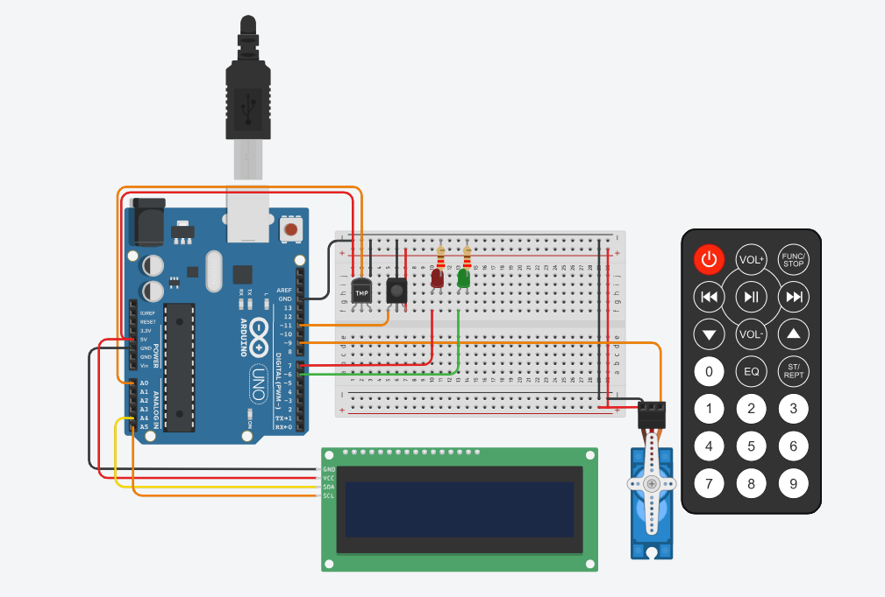

# Segundo Parcial SPD

## Integrantes 
- Mondani Agustin Claudio 

## Proyecto:

## Descripción
El proyecto consta de un control remoto IR el cual puede usarse para prender y apagar el dispositivo. Tambien elegir entre las 2 opciones
predetermiandas 1 para ver la temperatura y estacion del año asociada, y el 2 para poder activar una alarma contra incendios que al superar los 60°
se prende un servo motor que funcionaria como regador y nos da un alerta de warning.

## Función alarmaIncendio
Esta funcion se utiliza al estar activada la alarma contra incendios.

parametros: float -> una temperatura

La función analiza esa temperatura y si la misma es mayor a 60 le manda señal a un servomotor para que empiece a funcionar.

~~~ C (lenguaje en el que esta escrito)
void alarmaIncendio(float temp)
{
  if(temp > 60)
  {
    lcd.setCursor(0,0); // seteo en el cursor
  	lcd.print("--- WARNING ---");
    lcd.setCursor(0,1);
  	lcd.print("--- WARNING ---");
    
  	riego.write(90);//movimiento del servo
  	delay(1000);
  	riego.write(180);
  	delay(1000);
  	riego.write(0);
  	delay(1000);
  }else
  {
    lcd.setCursor(0,0); // seteo en el cursor
  	lcd.print("----- SAFE -----");
    lcd.setCursor(0,1);
  	lcd.print("----- SAFE -----");
    delay(1000);
  }
}

~~~

## Función estacion
Esta función nos dice la temperatura y la estacion del año por el display.

Parametros: float -> una temperatura

La función imprime en el display la temperatura actual y la estacion del año dependiendo la temperatura.

~~~ C (lenguaje en el que esta escrito)
void estacion(float temp)
{
  if(temp < 0)
  {
    lcd.setCursor(0,1);
    lcd.print("INVIERNO ");
  }else if (temp < 15)
  {
  	lcd.setCursor(0,1);
    lcd.print("OTONIO   ");
  }else if(temp < 25)
  {
    lcd.setCursor(0,1);
    lcd.print("PRIMAVERA");
  }else
  {
    lcd.setCursor(0,1);
    lcd.print("VERANO   ");
  }
}
~~~

## :Alarma: Link al proyecto
- [Tinkercad](https://www.tinkercad.com/things/722ZLrYLyRA-parcial-2/editel?sharecode=CxWv4dXDGQ4NkL8BIebrK1SV-XVG1mTf0kdBKowZ_tA)

---
### Fuentes

- [Ayuda Documentacion](https://github.com/AgustinMondani/EjemploDocumentacion/blob/main/README.md).

- [Tutorial]((https://www.youtube.com/watch?v=70f5_ZLV4kY&t=332s).

---
